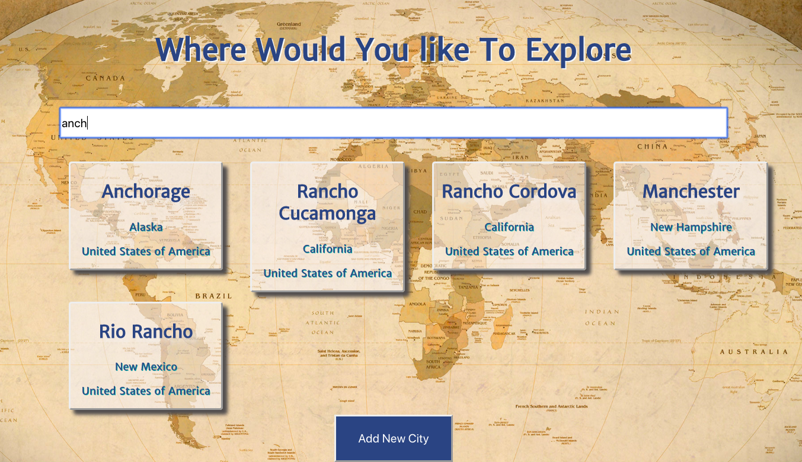
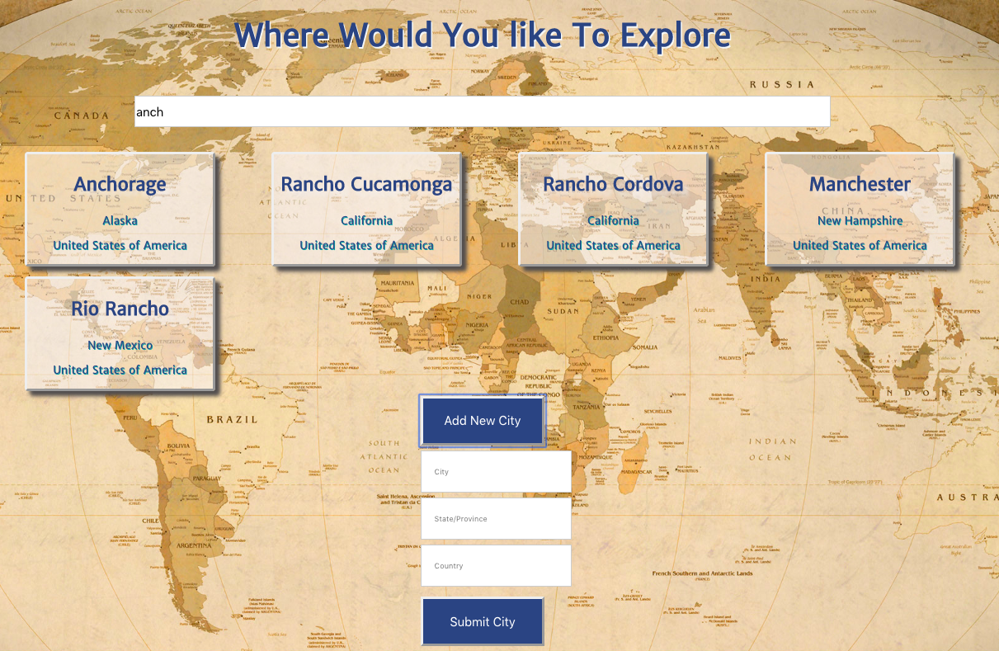
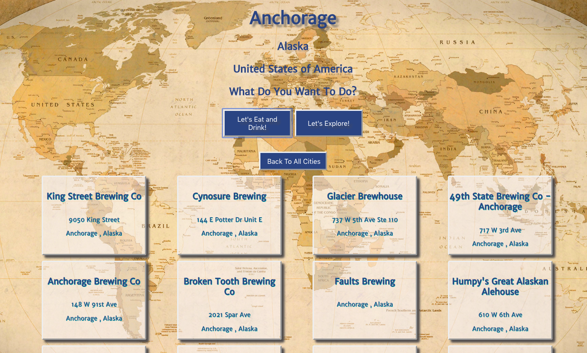
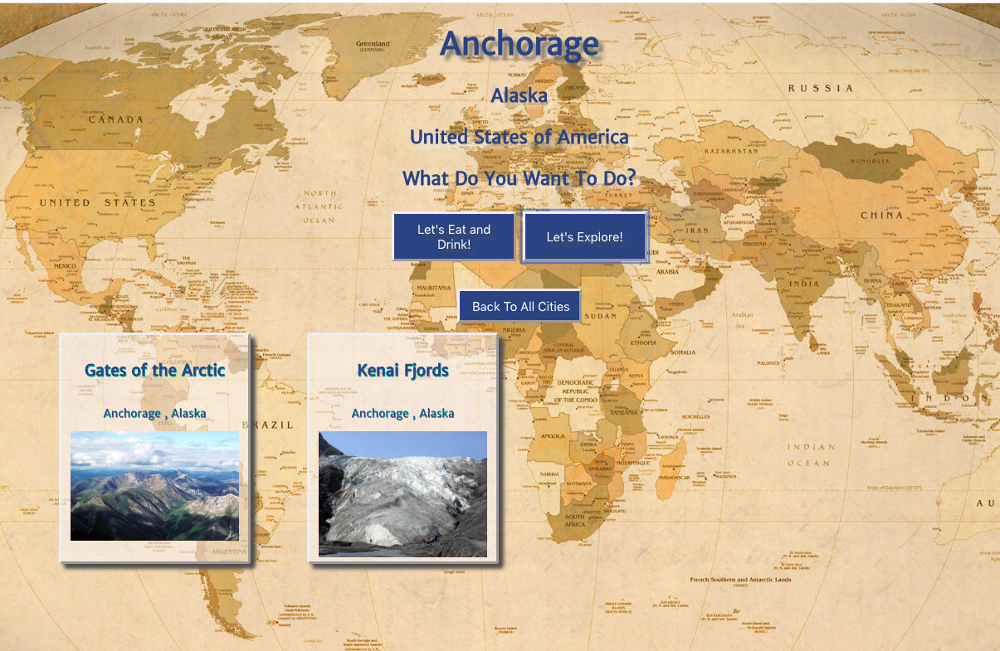

# Travel Planner
#### Designed by Arlene George with React

Travel Planner allows users to search over 740 Cities and to add any that are missing. Click on a city to view local places to eat and drink. You can also see if there are any National Parks in the area. 

## [View Deployed Web Application](https://travel-planning-app-112019.web.app/)

#### [Ruby on Rails API Repo on GitHub](https://github.com/ArleneGeorge/TravelApp)

### Features 

#### 1. Search for a US City 

#### 2. Add a Missing City

#### 3. View Places to Eat and Drink at a location

#### 4. View National Parks Near City
